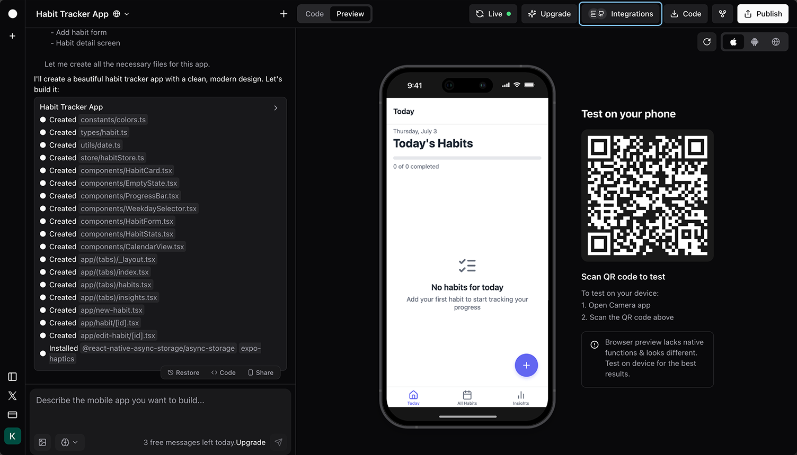
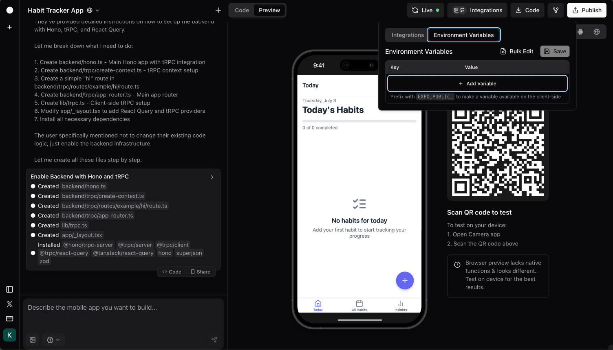

#### Integrations

# Firebase
#### Connect your Rork app's backend to Firebase database

[Firebase](https://firebase.google.com/) is Google's comprehensive app development platform offering **Cloud Firestore (NoSQL database)** along with powerful tools for **authentication, cloud storage, hosting, and real-time data synchronization**. By integrating your app's backend with Firebase database, you give your app a place to store and manage data. 

This means your app can remember things (like user-created notes, saved tasks, or chat messages) and display them whenever needed. If someone adds or updates something in the app, it gets stored safely in the cloud. With Firebase, your app can grow from a simple prototype into a smart, interactive tool that works like a real product.

## Before you start

### Create a Firebase account and project

Before integrating Rork with Firebase, you'll need a Firebase account and a Firebase project ready. If you don't have an account yet, you can [sign up for a free account](https://console.firebase.google.com/). You don't need to choose a paid plan just yet, Firebase's free tier (Spark plan) is generous and will be sufficient for most apps.

### Enable backend integration

For integration to work securely, you'll need to have backend integration enabled in your Rork project.

1. Click **Integrations**



2. Find **Backend** and click **Enable**


### Set up environment variables

You'll need to set up environment variables in your Rork project to connect to your Firebase project.

1. Click **Integrations**


2. Click **Environment Variables** > **Add Variable**



3. Go to your [Firebase project settings](https://console.firebase.google.com/project/_/settings/general/) and find the **Service Account** section. Generate a new private key and download the JSON file. You'll need to add the following variables:

- `FIREBASE_PROJECT_ID` (from the JSON file)
- `FIREBASE_PRIVATE_KEY` (from the JSON file)
- `FIREBASE_CLIENT_EMAIL` (from the JSON file)


4. Click **Save**


### (Optional) Create a collection

If you don't have a database collection in your Firebase project yet, you can create one by going to [your Firebase project Firestore Database](https://console.firebase.google.com/project/_/firestore) and clicking **Start collection**.

> [!NOTE]  
> Currently, Rork isn't able to manage the database schema for you yet, so you'll need to create collections and documents manually via the [Firebase console](https://console.firebase.google.com/project/_/firestore).

## Integrate Rork with Firebase

When you have both a Firebase project and backend integration set up, you can prompt Rork to add a Firebase integration to your project. Make sure to mention `backend` in your prompt, otherwise Rork will integrate with Firebase skipping the backend, making it less secure.

> [!NOTE]  
> Example prompt:
> ```
> Add a backend firebase integration
> ```

> [!TIP]  
> Sometimes you'll need to add user authentication to your project, and you can use Firebase Authentication for that as well. Usually, Rork will figure it out on its own, but if you know you'll need it, you can mention it in your integration prompt.

## Security considerations

### Firestore Security Rules

Firebase includes a powerful security feature called **Firestore Security Rules**. These rules control who can read or write specific documents and collections in your database.

When apps connect directly from the frontend (like in many no-code tools), Firestore Security Rules must be carefully configured to protect your data. But when using Rork's backend integration, your app connects to Firebase through a secure backend server using Firebase Admin SDK. **This means you don't need to configure complex security rules yourself.**

With Rork, your service account credentials stay hidden on the server, and with authentication set up, the backend ensures users only see or change what they're allowed to.

> [!WARNING]  
> If you ever decide to expose Firebase directly from the frontend (not recommended), then configuring proper Firestore Security Rules will be necessary.