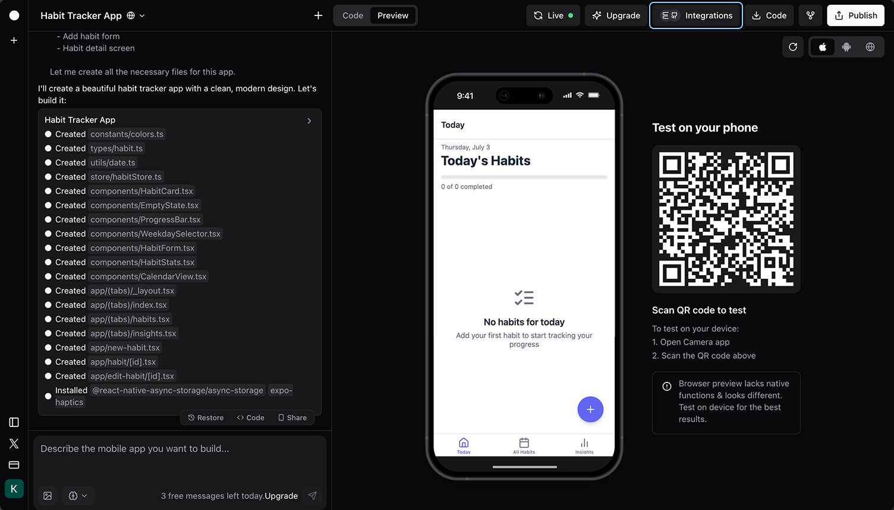
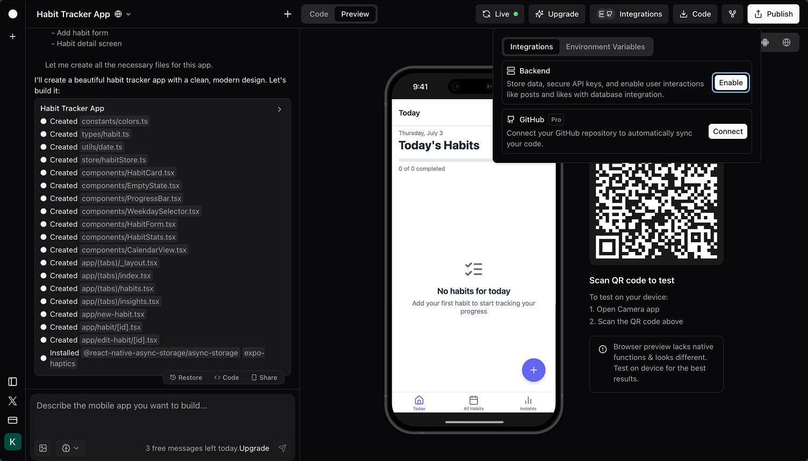
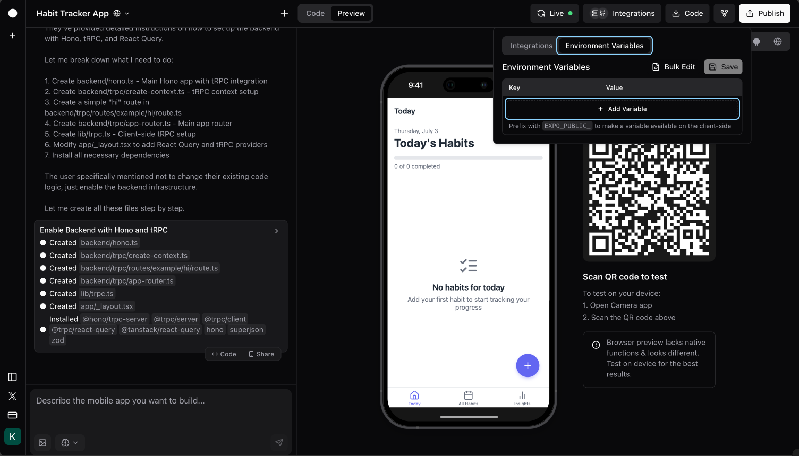
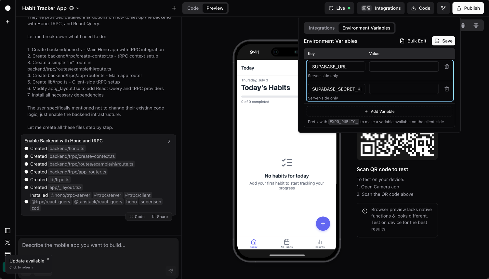
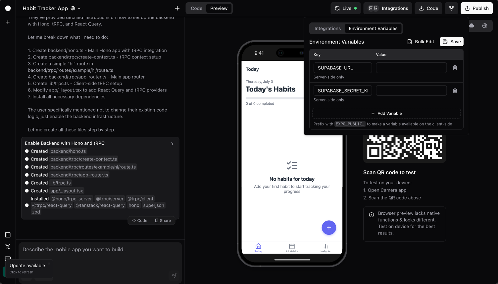

#### Integrations

# Supabase
### Connect your Rork app's backend to Supabase database

[Supabase](https://supabase.com/) is an open-source backend platform offering **a hosted PostgreSQL database** along with powerful tools for **authentication, storage, and real-time data synchronization**. By integrating your app's backend with Supabase database, you give your app a place to store and manage data. That means your app can remember things (like user-created notes, saved tasks, or chat messages) and display them whenever needed. If someone adds or updates something in the app, it gets stored safely in the cloud. With Supabase, your app can grow from a simple prototype into a smart, interactive tool that works like a real product.

## Before you start

### Create a Supabase account and project

Before integrating Rork with Supabase, you'll need a Supabase account and a Supabase project ready. If you don't have an account yet, you can [sign up for a free account](https://supabase.com/dashboard/sign-up). You don't need to choose a paid plan just yet, Supabase's free tier is generous and will be sufficient for most apps.

### Enable backend integration

For integration to work securely, you'll need to have backend integration enabled in your Rork project.

1. Click **Integrations**



2. Find **Backend** and click **Enable**



### Set up environment variables

You'll need to set up environment variables in your Rork project to connect to your Supabase project.

1. Click **Integrations**


2. Click **Environment Variables** > **Add Variable**



3. Go to [your Supabase project settings](https://supabase.com/dashboard/project/_/settings/api) and find the **URL** and **Secret Key**. Fill the values accordingly to the following variables:

- `SUPABASE_URL`
- `SUPABASE_SECRET_KEY`



4. Click **Save**



### (Optional) Create a table

If you don't have a database table in your Supabase project yet, you can create one by going to [your Supabase project database tables](https://supabase.com/dashboard/project/_/database/tables) and clicking **New table**.

> [!NOTE]  
> As for now, Rork isn't able to manage the database schema for you yet, so you'll need to create tables manually via [Supabase web interface](https://supabase.com/dashboard/project/_/database/tables).

## Integrate Rork with Supabase

When you have both a Supabase project and backend integration set up, you can prompt Rork to add a Supabase integration to your project. Make sure to mention `backend` in your prompt, otherwise Rork will integrate with Supabase skipping the backend making it less secure.

> [!NOTE]  
> Example prompt:
> ```prompt
> Add a backend supabase integration
> ```

> [!TIP]  
> Sometimes you'll need to add user authentication to your project and you can use Supabase for that as well. Usually, Rork will figure it out on its own, but if you know you'll need it, you can mention it in your integration prompt.

## Security concerns

### Row Level Security (RLS)

Supabase includes a powerful security feature called **Row Level Security (RLS)**. It controls who can read or write specific rows in your database.

When apps connect directly from the frontend (like in many no-code tools), RLS must be set up to protect your data. But when using Rork's backend integration, your app connects to Supabase through a secure backend server. **This means you don't need to configure RLS yourself.**

Rork handles secure access for you—your secret keys stay hidden, and the backend ensures users only see or change what they're allowed to.

> [!WARNING]  
> If you ever decide to expose Supabase directly from the frontend (not recommended), then enabling and configuring RLS will be necessary.